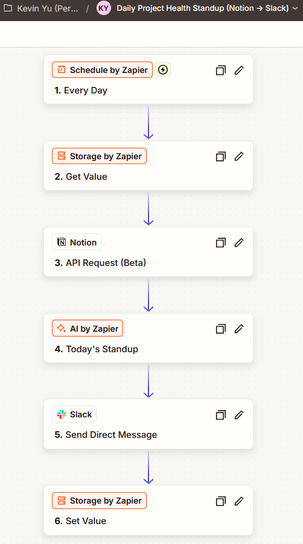

# Project Health Roll-up

A no-code automation that reads my active projects from Notion every morning, uses
AI to score each one **Green / Yellow / Red**, highlights **what changed since
yesterday**, and posts a single standup to Slack.

Built with Zapier, Notion, and an AI step. No code, no scripting.


## Why I built it

Project status usually lives scattered across notes and deadlines, and nobody
re-reads it. I wanted one glanceable message each morning that tells me where to
look first, and, more importantly, **what moved overnight**, without me opening
anything.

## What it does

Every morning it:

1. Pulls all **Active** projects from a Notion database.
2. Sends them to an AI step that scores each project's health and writes a short,
   blunt reason.
3. Compares today's scores against yesterday's and surfaces any changes at the top.
4. Posts the finished standup to Slack as a single message.

Example output:

```
Morning standup - Jun 2, 2026

⚡ CHANGED OVERNIGHT
- Vendor portal migration: Red -> Green (blocker cleared)
- Onboarding kit v2: Green -> Red (milestone in 2 days)

🔴 RED
- Henley pitch deck: milestone in 2 days, slides half done
- Onboarding kit v2: milestone in 2 days, reviewer out

🟡 YELLOW
- Q3 budget review: milestone within a week, awaiting replies

🟢 GREEN (2): Vendor portal migration, Newsletter relaunch
```

## Try it yourself

This workflow is published as a Zapier guided template. You can copy it into your own Zapier account:

[Get the Zap template](https://zapier.com/templates/details/daily-project-health-standup-notion-to-slack-with-ai-scoring-1a28d2?secret=MTp0ZW1wbGF0ZTotMnhzeVNILURGOHBhbmxwcS1EWlNuZVZhY0Zibk8wek93cC1jVG96OGVBOnl6dHpjZQ)

You connect your own Notion, Slack, and Storage, then drop in your own Notion database id. None of my accounts, keys, or ids are included in the template.

## How it works

A scheduled, AI-scored automation with one twist: it remembers its own previous
output, so it can report deltas instead of a flat list.



| Stage | What happens |
|---|---|
| Schedule | Fires once every morning |
| Read memory | Loads yesterday's standup from storage |
| Pull data | Fetches all Active projects from Notion |
| Score + compare | AI rates each project and diffs against yesterday |
| Notify | Posts the standup to Slack |
| Save memory | Stores today's standup for tomorrow's comparison |

The "read memory" and "save memory" stages are what let the standup lead with
**CHANGED OVERNIGHT**. A plain scheduled automation has no sense of yesterday;
this one does.

## The data model

A single Notion database drives everything. Upkeep is about two minutes a week:
jot a short progress note, set a date, and the automation handles the rest.


| Field | Purpose |
|---|---|
| Project | Name |
| Status | Active / On hold / Done (only Active is scored) |
| Update notes | Short progress note the AI reads |
| Last update | Staleness signal |
| Next milestone | Urgency signal |
| Health | Optional, for manual or formula-based color in Notion |
| Why | Optional notes field |

Notion is read-only in this build: The automation reads project fields and posts
the result to Slack. It does not write back. The AI's color and reason appear in
the Slack standup.

## Scoring logic

- **Red:** milestone within 3 days and not on track, a named blocker, or no
  update in over 14 days.
- **Yellow:** no update in 7 to 14 days, or a milestone within a week with unclear
  progress.
- **Green:** recent update and no near-term risk.

The exact wording lives in [`ai-prompt.md`](ai-prompt.md).

## Stack

- **Zapier** for the scheduling, data, storage, and Slack delivery
- **Notion** as the project database
- **AI step** for scoring and the change comparison
- **Slack** for the daily delivery

## What's in this repo

| File | What it is |
|---|---|
| `README.md` | This overview |
| `ai-prompt.md` | The AI scoring + change-detection prompt |
| `projects-day1.csv` | The same sample data, ready to import into Notion |

All sample data is fictional. No real project names, credentials, or IDs are
included anywhere in this repo.
